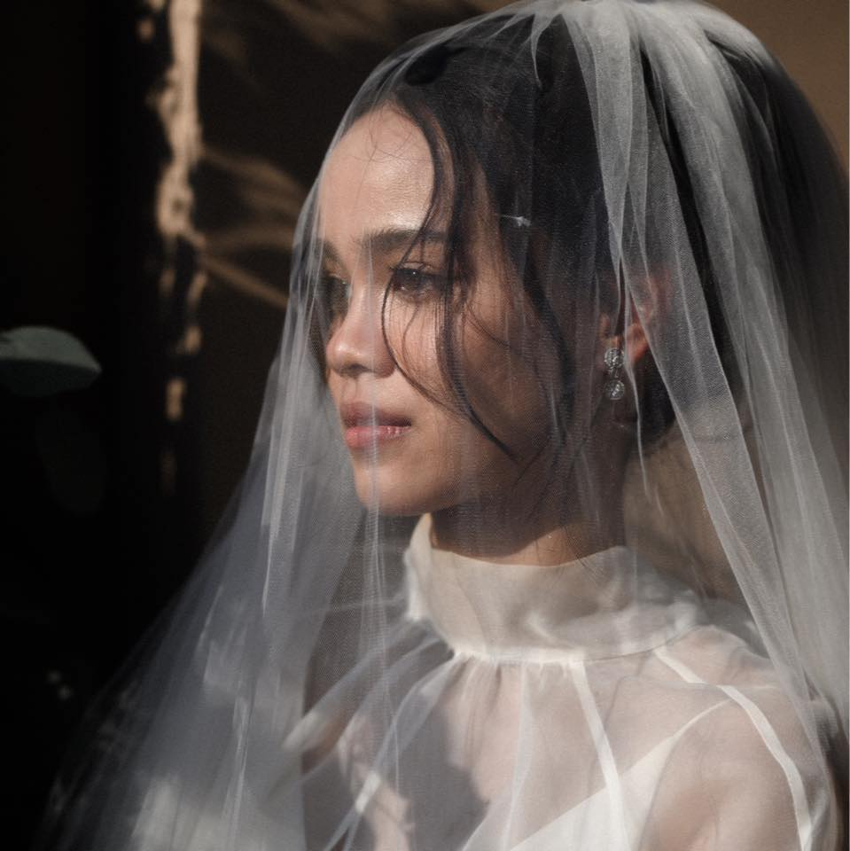

# Panchiwa Komol - Creative Developer Portfolio



> A modern, minimalist portfolio website designed to showcase creative work with elegance and interactivity. Built with Next.js, Tailwind CSS, and Framer Motion.

## 🚀 Overview

This portfolio embodies a "Minimalist Design, Maximum Impact" philosophy. It features a high-contrast dark theme with vibrant neon pink and purple accents, smooth scroll animations, and a custom magnetic cursor to provide an immersive user experience.

## ✨ Key Features

-   **Creative Hero Section**: Split-screen layout with a monochrome visual focus and interactive text animations.
-   **Smooth Interactions**: Custom magnetic cursor and seamless page transitions.
-   **Dynamic Animations**: Powered by `framer-motion` for scroll-triggered reveals and hover effects.
-   **Responsive Design**: Fully optimized layout for Mobile, Tablet (iPad), and Desktop screens.
-   **Modern Tech Stack**: Built on the robust Next.js 15 (App Router) framework.

## 🛠️ Tech Stack

-   **Framework**: [Next.js 15](https://nextjs.org/) (React 19)
-   **Styling**: [Tailwind CSS v4](https://tailwindcss.com/)
-   **Animations**: [Framer Motion](https://www.framer.com/motion/)
-   **Icons**: [Lucide React](https://lucide.dev/)
-   **Language**: TypeScript

## 🏁 Getting Started

Follow these steps to set up the project locally.

### Prerequisites

-   Node.js (v18 or higher)
-   npm, yarn, or bun

### Installation

1.  Clone the repository:
    ```bash
    git clone https://github.com/peakpoon_pk/portfolio.git
    cd portfolio/frontend
    ```

2.  Install dependencies:
    ```bash
    npm install
    # or
    yarn install
    ```

3.  Run the development server:
    ```bash
    npm run dev
    ```

4.  Open [http://localhost:3000](http://localhost:3000) in your browser.

## 📂 Project Structure

```bash
├── app/                  # Next.js App Router pages and layout
│   ├── globals.css       # Global styles & Tailwind directives
│   ├── layout.tsx        # Root layout with Metadata & Fonts
│   └── page.tsx          # Main landing page composition
├── components/           # Reusable UI components
│   ├── Hero.tsx          # Hero section with split-screen layout
│   ├── About.tsx         # About section
│   ├── Work.tsx          # Projects grid
│   ├── Header.tsx        # Navigation bar
│   ├── Footer.tsx        # Footer with social links
│   └── Cursor.tsx        # Custom magnetic cursor
└── public/               # Static assets (images, icons)
```

## 🎨 Customization

-   **Colors**: Edit `app/globals.css` to change the CSS variables for the brand theme (e.g., `--color-brand-primary`).
-   **Hero Image**: Replace `public/hero-image.png` with your own portrait (recommended size: 1080x1920 or higher).
-   **Content**: Update text directly in the component files (`components/Hero.tsx`, `components/About.tsx`, etc.).

